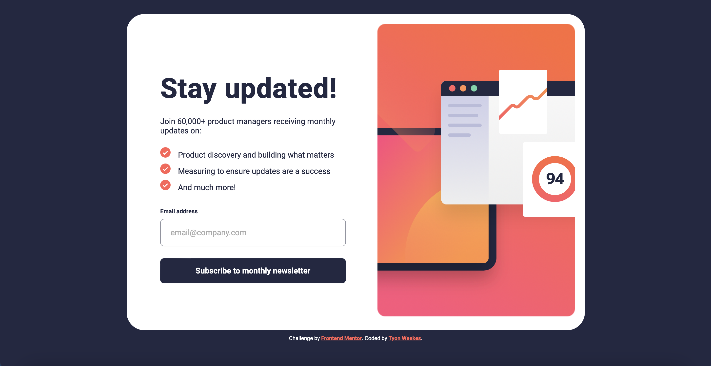

# Frontend Mentor - Newsletter sign-up form with success message solution

This is a solution to the [Newsletter sign-up form with success message challenge on Frontend Mentor](https://www.frontendmentor.io/challenges/newsletter-signup-form-with-success-message-3FC1AZbNrv). Frontend Mentor challenges help you improve your coding skills by building realistic projects. 

## Table of contents

- [Overview](#overview)
  - [The challenge](#the-challenge)
  - [Screenshot](#screenshot)
  - [Link](#link)
- [My process](#my-process)
  - [Built with](#built-with)
  - [What I learned](#what-i-learned)
  - [Continued development](#continued-development)
- [Author](#author)
- [Acknowledgments](#acknowledgments)

## Overview

### The challenge

Users should be able to:

- Add their email and submit the form
- See a success message with their email after successfully submitting the form
- See form validation messages if:
  - The field is left empty
  - The email address is not formatted correctly
- View the optimal layout for the interface depending on their device's screen size
- See hover and focus states for all interactive elements on the page

### Screenshot

### Link

- Live Site URL: [Newsletter Sign-Up Form with Success Message](https://precious-dieffenbachia-1ffe13.netlify.app)

## My process

### Built with

- Semantic HTML5 markup
- CSS custom properties
- Flexbox

### What I learned

I learned more about custom validation with some new styling. I learned how to use images as bullet points and how to position list elements (inside or outside).

### Continued development

React, accessibility, CSS animations and testing.

## Author

- Website - [Tyon Weekes](https://www.tyonweekes.com)

## Acknowledgments

Thanks to @ZENSE-THAI with the ul li elements' inside positioning and spacing. Also thanks to @josh76543210. I saw their solution using grid like @ZENSE_THAI. I ended up not using it, but it's a good idea.
